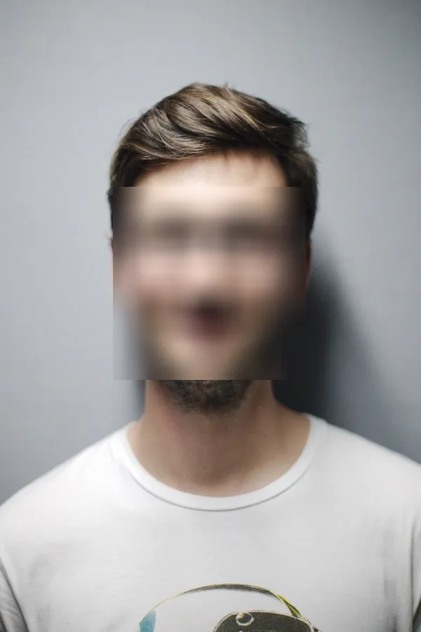

# 🫣 Face Blur Tool

A simple Gradio web app that uses **MediaPipe** and **OpenCV** to detect and blur faces in images or videos. Perfect for privacy protection, content anonymization, or educational demos in computer vision.

| Original                           | Blurred                          |
|------------------------------------|----------------------------------|
|  |  |

## 🚀 Features

- **Image Face Blur**: Upload an image or choose an example — faces are detected and blurred instantly.
- **Video Face Blur**: Upload a video — the app processes and returns an anonymized version with blurred faces.

## 🔧 Tech Stack

- [Gradio](https://www.gradio.app/)
- [MediaPipe](https://mediapipe.dev/)
- [OpenCV](https://opencv.org/)

## 📁 Project Structure

```bash
.
├── app.py              # Gradio app logic
├── examples/           # Example images and videos
├── requirements.txt    # Dependencies
└── README.md           # This file

